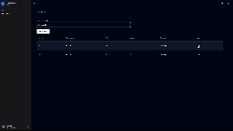

<h1 align="center">
<pre>

  ______                                    __  __               _          _   
 |  ____|                                  |  \/  |             | |        | |  
 | |__   __  __ _ __   _ __  ___  ___  ___ | \  / |  __ _  _ __ | | __ ___ | |_ 
 |  __|  \ \/ /| '_ \ | '__|/ _ \/ __|/ __|| |\/| | / _` || '__|| |/ // _ \| __|
 | |____  >  < | |_) || |  |  __/\__ \\__ \| |  | || (_| || |   |   <|  __/| |_ 
 |______|/_/\_\| .__/ |_|   \___||___/|___/|_|  |_| \__,_||_|   |_|\_\\___| \__|
               | |                                                              
               |_|                                                              
                                                                                                 
</pre>
</h1>

<h4 align="center">
  A simple Full-Stack shop application built with Express.js and React
</h4>


<p align="center">
###Frontend
[](https://img.shields.io/badge/typescript-%23007ACC.svg?style=flat-square&logo=typescript&logoColor=white)
[](https://img.shields.io/badge/react-%2320232a.svg?style=flat-square&logo=react&logoColor=%2361DAFB)
[](https://img.shields.io/badge/React%20Hook%20Form-%23EC5990.svg?style=flat-square&logo=reacthookform&logoColor=white)
[](https://img.shields.io/badge/React_Router-CA4245?style=flat-square&logo=react-router&logoColor=white)
[](https://img.shields.io/badge/tailwindcss-%2338B2AC.svg?style=flat-square&logo=tailwind-css&logoColor=white)

[](https://img.shields.io/badge/JWT-black?style=flat-square&logo=JSON%20web%20tokens)
###Backend
[](https://img.shields.io/badge/javascript-%23323330.svg?style=flat-square&logo=javascript&logoColor=%23F7DF1E)
[](https://img.shields.io/badge/postgres-%23316192.svg?style=flat-square&logo=postgresql&logoColor=white)
[](https://img.shields.io/badge/express.js-%23404d59.svg?style=flat-square&logo=express&logoColor=%2361DAFB)
[](https://img.shields.io/badge/JWT-black?style=flat-square&logo=JSON%20web%20tokens)


</p>


<p align="center">
  <a href="#overview">Overview</a> •
  <a href="#key-features">Key Features</a> •
  <a href="#how-to-use">How To Use</a> •
  <a href="#license">License</a> 
</p>

<h4 align="center">
  
</h4>

## Overview
This project was created for Applications in Interpreted Languages(AJI) course on Technical University of Lodz.

## Key Features
* Role-Based Access Control
* JWT with refresh
* Groq integration
* ORM with Sequelize
* PostgreSQL Database
* Request validation with Ajv JSON schema validator
* UI built with shadcn and tailwind
* Frontend validation with react hook forms and Zod

## How To Use
To clone and run this application, you'll need [Git](https://git-scm.com) and [Docker](https://www.docker.com/) From your command line:
```bash
# Clone this repository
$ git clone https://github.com/MatixExport/ExpressMarket

# Go into the repository
$ cd ExpressMarket

# Run the app
$ docker compose up
```
Frontend site is available on: http://localhost:5173

### Default user accounts

| Login   | Password |
|---------|----------|
| client  | MarketPassword |
| employee| MarketPassword |

## License

MIT


